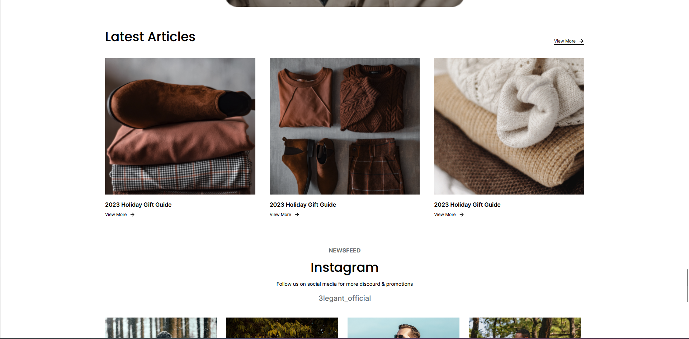
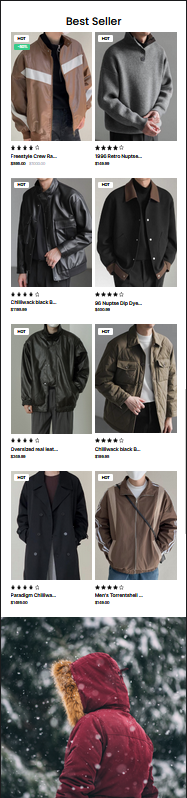

<h1 align="center">Welcome to 3legant 👋</h1>
<p>
  
</p>

> This landing page was created to familiarize myself with TailwindCSS and more specifically with the responsive side.
>
> I used this figma model for the design: https://www.figma.com/file/1QEk20NzSIIRxX4mNJehtp/3legant-E-Commerce-UI-Design-Template-(Community)?type=design&node-id=3-674&mode=design&t=5PKrXbGQEgnoc2iu-0





## Install

```sh
npm install
```

## Usage

```sh
ng serve
```

## Run tests

```sh
npm run test
```

## Author

👤 **Ryan Foerster**

- Github: [@RyanFoerster](https://github.com/RyanFoerster)
- LinkedIn: [@https:\/\/www.linkedin.com\/in\/ryan-foerster](https://linkedin.com/in/https://www.linkedin.com/in/ryan-foerster)
